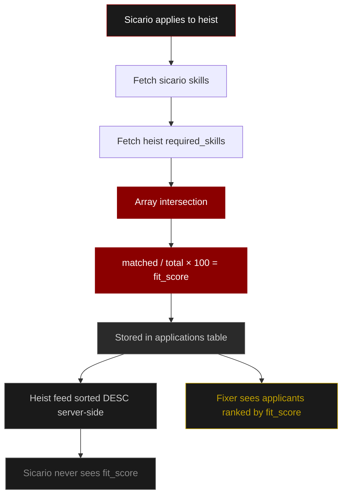
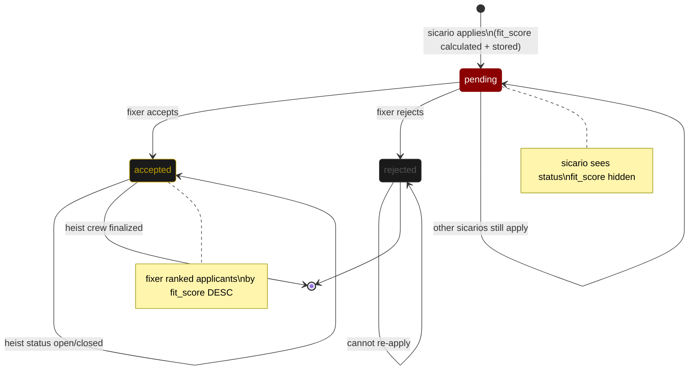

# Sicari.works — The Syndicate

> Underground criminal job board. Las Vegas themed. Sicarios find heists, Fixers post them.

Live at **[sicari.works](https://sicari.works)** — API at **[api.sicari.works](https://api.sicari.works)**

---

## Stack

| Layer | Tech |
|---|---|
| Frontend | React + Vite, React Router, Typed.js |
| Backend | Node.js, Express.js |
| Database | MySQL 8.0 — Railway |
| Images | Cloudinary — 3 isolated folders |
| Auth | JWT in HttpOnly cookies |
| Validation | Zod — fixed 20-skill vocabulary |
| Security | helmet, bcrypt, cors, sanitize-html |
| Infra | Railway CI/CD, Cloudflare (DDoS, SSL, Layer 7) |

---

## Flagship Feature — Matching Engine

Array intersection of sicario skills vs heist required roles → weighted fit score (0–100%) computed server-side. Heist feed sorted before response. Score stored on application for fixer review. Never exposed to sicario.

---

## Application Lifecycle



---

## Security

| | |
|---|---|
| HttpOnly JWT | JS cannot access token — XSS proof |
| bcrypt 12 rounds | Auto-upgrades legacy plaintext on login |
| Role-based access | `checkRole()` on every protected route |
| Parameterized queries | Zero string concat — SQL injection proof |
| Zod validation | `req.body` validated before controller. Role is strict enum |
| sanitize-html | All user input stripped before DB insert |
| helmet + CORS | Express fingerprint hidden, origin whitelisted |
| Edge Guard | x-edge Cloudflare secret — ready to enable |

---

## API Routes

### `/api/auth`
| Method | Route | |
|---|---|---|
| POST | `/register` | role: `"sicario"` or `"fixer"` |
| POST | `/login` | role must match registered role |
| POST | `/logout` | clears JWT cookie |
| POST | `/check-user` | username exists check |
| GET | `/me` | logged-in user info |

### `/api/posts`
| Method | Route | |
|---|---|---|
| GET | `/` | feed — upvotes, downvotes, score, my_vote |
| POST | `/add` | content (req), title (opt), photo (file, opt) |
| POST | `/:id/vote` | reddit-style toggle — `1` or `-1` |

### `/api/sicario`
| Method | Route | |
|---|---|---|
| GET | `/profile` | own profile + connection_count |
| PUT | `/profile` | update profile + optional photo |
| GET | `/heists` | open heists sorted by fit score |
| POST | `/apply/:heistId` | one-click apply |
| GET | `/applications` | own applications + status |

### `/api/fixer`
| Method | Route | |
|---|---|---|
| GET | `/profile` | own profile + connection_count |
| PUT | `/profile` | update profile + optional photo |
| POST | `/heist/add` | post heist — up to 3 photos |
| GET | `/heists` | own heists only |
| GET | `/heist/:id/applicants` | applicants ranked by fit_score |
| PATCH | `/application/:id` | `"accepted"` or `"rejected"` |

### `/api/connections`
| Method | Route | |
|---|---|---|
| POST | `/request/:userId` | send request |
| PATCH | `/:id/accept` | receiver only |
| PATCH | `/:id/decline` | receiver only |
| DELETE | `/:id` | unfriend or withdraw |
| GET | `/` | accepted connections |
| GET | `/pending` | incoming requests |
| GET | `/sent` | outgoing requests |

### `/api/profile`
| Method | Route | |
|---|---|---|
| GET | `/:username` | public profile — includes `connection_status` and `connection_count` |

> `connection_status`: `"none"` · `"sent"` · `"received"` · `"connected"` · `"declined"`

---

## Getting Started

```bash
# Backend
cd server && npm install
npm run dev        # nodemon
npm start          # production

# Frontend
cd client && npm install
npm run dev        # Vite
npm run build      # production
```

`.env` required in `server/`:

```env
MYSQLHOST=        MYSQLPORT=3306
MYSQLUSER=        MYSQLPASSWORD=
MYSQLDATABASE=    JWT_SECRET=
CLOUDINARY_CLOUD_NAME=
CLOUDINARY_API_KEY=
CLOUDINARY_API_SECRET=
PORT=8080         NODE_ENV=production
FRONTEND_URL=https://sicari.works
```

> Tables auto-created on first run via `initDatabase()`. No migration scripts needed.

---

## Pending

- [ ] JWT rotation + 15 min expiry + refresh tokens
- [ ] IP binding + device fingerprinting
- [ ] Redis — token blacklist on logout
- [ ] Audit logging — failed auth attempts
- [ ] Edge Guard re-enable

---

*Built at IIIT Bangalore — Hacknite.*

- Ayaan Sharma (BC2025017) 
- Arush Kumar Jain (BC2025013)  
- Yug Porwal (BC2025121)  

---

 *Started as random whiteboard scribbles, turned into long “bhai this won’t work” debates and somehow ended up as a system that actually does.*