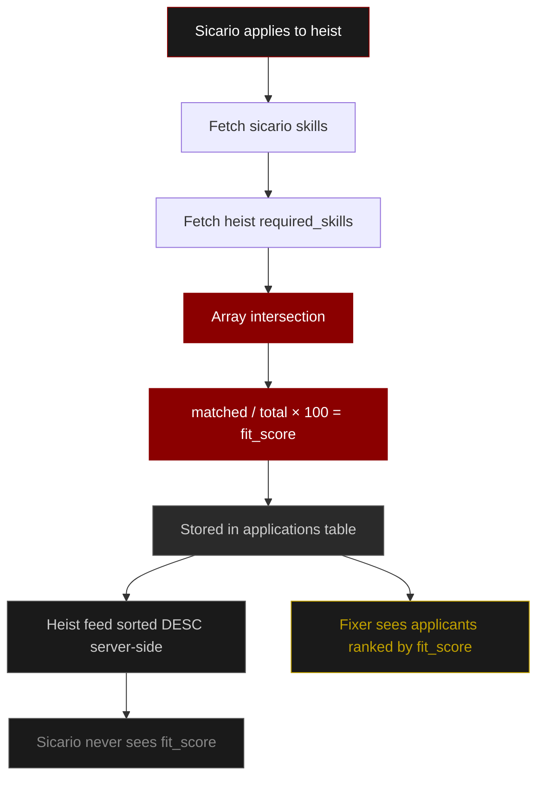
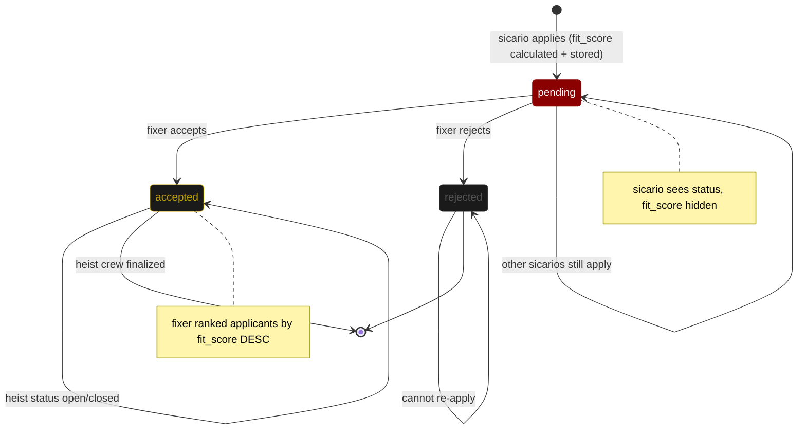

# Sicari.works

> **Sicari.works is a full-stack, role-based matching platform disguised as an underground Las Vegas job board.**
> Beneath the thematic UI lies a robust Node.js and Express backend engineered for secure data isolation and complex state management. It connects Fixers (job posters) with Sicarios (applicants) using a custom server-side matching engine. By computing the array intersection between a candidate's defined skills and a job's strict requirements, the system generates a weighted fit_score and dynamically sorts the payload before the API responds.
>
> Built with a zero-trust approach, the architecture implements HttpOnly JWT authentication, strict Zod schema validation for all incoming payloads, and parameterized MySQL queries to eliminate injection vulnerabilities, all deployed on Railway behind Cloudflare's Layer 7 protection.

Live at **[sicari.works](https://sicari.works)** and API at **[api.sicari.works](https://api.sicari.works)**

  
  
  
  
  
  
  
  
  

---

## Stack

| Layer | Tech |
|---|---|
| Frontend | React + Vite, React Router, Typed.js |
| Backend | Node.js, Express.js |
| Database | MySQL 8.0 — Railway |
| Images | Cloudinary — 3 isolated folders |
| Auth | JWT in HttpOnly cookies |
| Validation | Zod — fixed 20-skill vocabulary |
| Security | helmet, bcrypt, cors, sanitize-html |
| Infra | Railway CI/CD, Cloudflare (DDoS, SSL, Layer 7) |

---

## Flagship Feature — Matching Engine

Array intersection of sicario skills vs heist required roles → weighted fit score (0–100%) computed server-side. Heist feed sorted before response. Score stored on application for fixer review. Never exposed to sicario.

---

## Application Lifecycle

---

## Security

| Layer | Implementation |
|---|---|
| HttpOnly JWT | JS cannot access token — XSS proof |
| bcrypt 12 rounds | Auto-upgrades legacy plaintext on login |
| Role-based access | checkRole() on every protected route |
| Parameterized queries | Zero string concat — SQL injection proof |
| Zod validation | req.body validated before controller. Role is strict enum |
| sanitize-html | All user input stripped before DB insert |
| helmet + CORS | Express fingerprint hidden, origin whitelisted |
| Edge Guard | x-edge Cloudflare secret — ready to enable |

---

## API Routes

### /api/auth

| Method | Route | Description |
|---|---|---|
| POST | /register | role: sicario or fixer |
| POST | /login | role must match registered role |
| POST | /logout | clears JWT cookie |
| POST | /check-user | username exists check |
| GET | /me | logged-in user info |

### /api/posts

| Method | Route | Description |
|---|---|---|
| GET | / | feed — upvotes, downvotes, score, my_vote |
| POST | /add | content (req), title (opt), photo (file, opt) |
| POST | /:id/vote | reddit-style toggle — 1 or -1 |

### /api/sicario

| Method | Route | Description |
|---|---|---|
| GET | /profile | own profile + connection_count |
| PUT | /profile | update profile + optional photo |
| GET | /heists | open heists sorted by fit score |
| POST | /apply/:heistId | one-click apply |
| GET | /applications | own applications + status |

### /api/fixer

| Method | Route | Description |
|---|---|---|
| GET | /profile | own profile + connection_count |
| PUT | /profile | update profile + optional photo |
| POST | /heist/add | post heist — up to 3 photos |
| GET | /heists | own heists only |
| GET | /heist/:id/applicants | applicants ranked by fit_score |
| PATCH | /application/:id | accepted or rejected |

### /api/connections

| Method | Route | Description |
|---|---|---|
| POST | /request/:userId | send request |
| PATCH | /:id/accept | receiver only |
| PATCH | /:id/decline | receiver only |
| DELETE | /:id | unfriend or withdraw |
| GET | / | accepted connections |
| GET | /pending | incoming requests |
| GET | /sent | outgoing requests |

### /api/profile

| Method | Route | Description |
|---|---|---|
| GET | /:username | public profile — includes connection_status and connection_count |

connection_status values: none · sent · received · connected · declined

---

## Getting Started

Clone the repo and install dependencies for both client and server.

**Backend**

    cd server
    npm install
    npm run dev      # nodemon — development
    npm start        # production

**Frontend**

    cd client
    npm install
    npm run dev      # Vite dev server
    npm run build    # production build

Create a .env file in server/ with the following variables:

    MYSQLHOST=
    MYSQLPORT=3306
    MYSQLUSER=
    MYSQLPASSWORD=
    MYSQLDATABASE=
    JWT_SECRET=
    CLOUDINARY_CLOUD_NAME=
    CLOUDINARY_API_KEY=
    CLOUDINARY_API_SECRET=
    PORT=8080
    NODE_ENV=production
    FRONTEND_URL=https://sicari.works

Tables are auto-created on first run via initDatabase(). No migration scripts needed.

---

*Built at IIIT Bangalore — Hacknite.*

- Ayaan Sharma (BC2025017)
- Arush Kumar Jain (BC2025013)
- Yug Porwal (BC2025121)

---

*Started as random whiteboard scribbles, turned into long "bhai this won't work" debates and somehow ended up as a system that actually does.*
